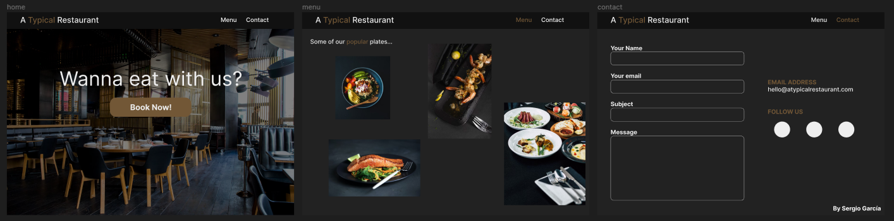
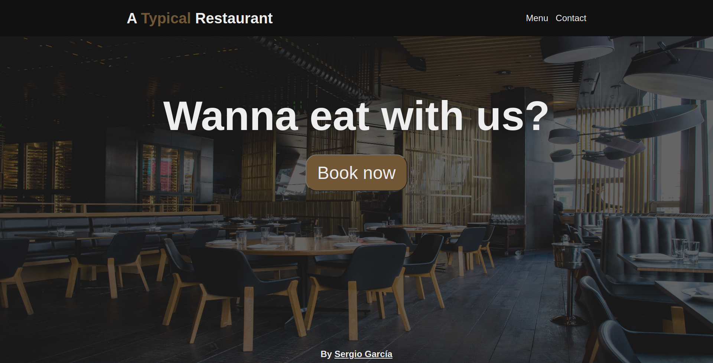
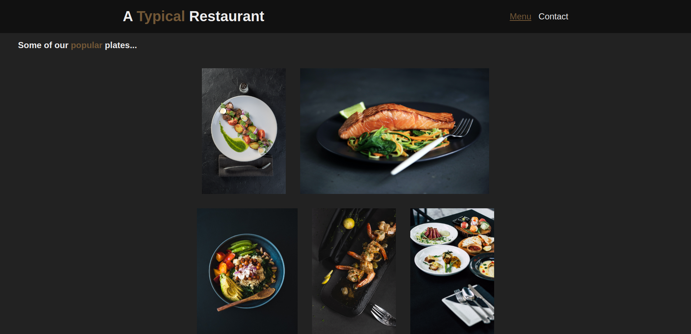
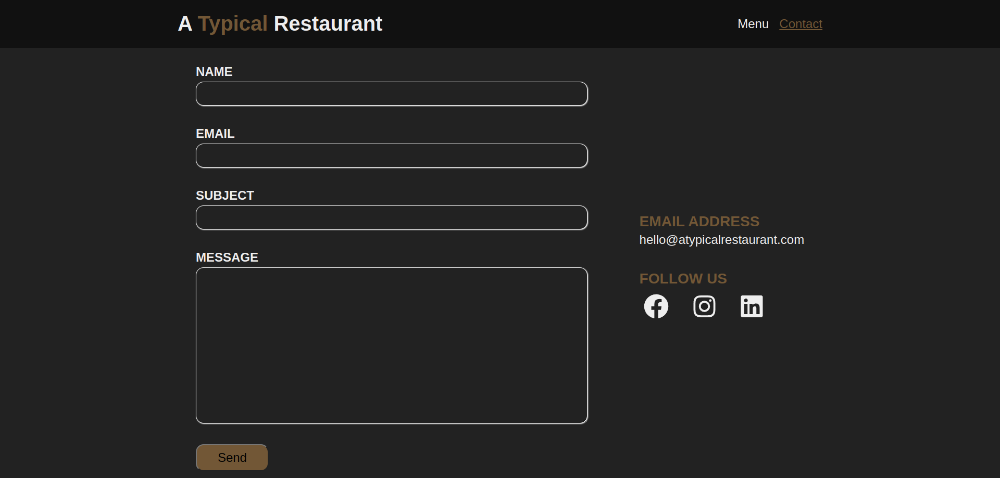

# Restaurant Page

A simple restaurant page from [The Odin Project](https://www.theodinproject.com/lessons/node-path-javascript-restaurant-page) curriculum.

## Learnings

- Use of webpack and how to configure it
- Use of modules (import and export)

## Screenshots

### Design in Figma

### Final Result

## Acknowledgements

- Project idea by [The Odin Project](https://www.theodinproject.com/)

- Photo authors: (on [Unplash](https://unsplash.com/photos/poI7DelFiVA?utm_source=unsplash&utm_medium=referral&utm_content=creditCopyText))

  - [Jason Leung](https://unsplash.com/@ninjason?utm_source=unsplash&utm_medium=referral&utm_content=creditCopyText)

  - [Mgg Vitchakorn](https://unsplash.com/@mggbox?utm_source=unsplash&utm_medium=referral&utm_content=creditCopyText)

  - [Huzaifa Bukhari](https://unsplash.com/@huzaifabukhari1?utm_source=unsplash&utm_medium=referral&utm_content=creditCopyText)

  - [Sonny Mauricio](https://unsplash.com/@northernstatemedia?utm_source=unsplash&utm_medium=referral&utm_content=creditCopyText)

  - [Food Photographer](https://unsplash.com/pt-br/@phototastyfood?utm_source=unsplash&utm_medium=referral&utm_content=creditCopyText)

  - [CA Creative](https://unsplash.com/@ca_creative?utm_source=unsplash&utm_medium=referral&utm_content=creditCopyText)

- Web icon from [favicon](https://favicon.io/)

## Author

[Sergio García](https://github.com/sergiogarciiam)

## License

This project is open source and available under the [MIT License](./LICENSE).
